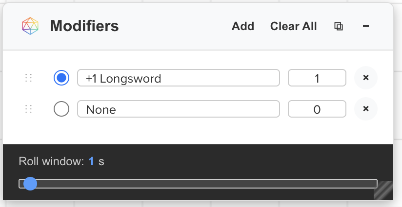
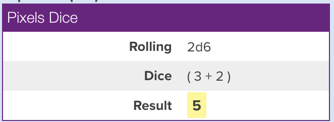
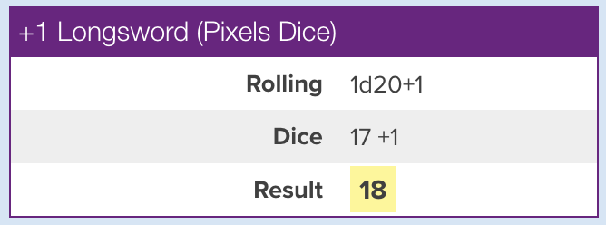
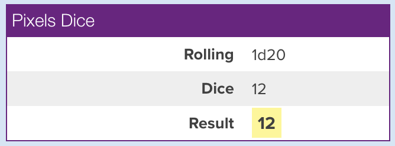
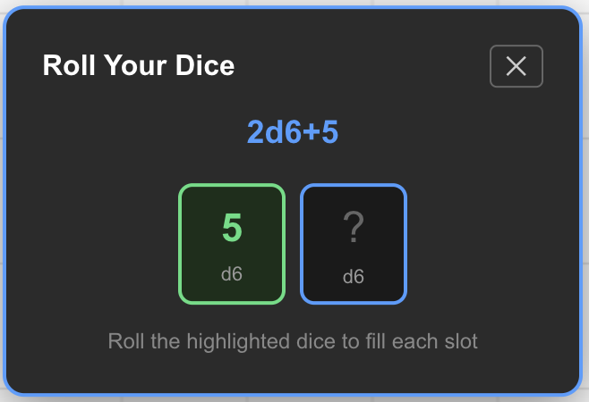
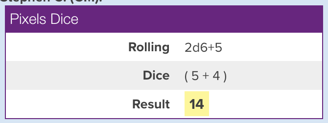

# User Guide

## Overview

PixelLink for Roll20 connects your physical Pixels dice to Roll20 via Bluetooth, allowing your physical dice rolls to appear automatically in the Roll20 chat with optional modifier support.

**System-independent**: PixelLink works with any Roll20 game — D&D 5e, Pathfinder, Shadowrun, FATE, Call of Cthulhu, or any other system. It has no dependencies on a specific character sheet, compendium, API scripts, or campaign configuration. It communicates entirely through Roll20's chat, so if you can type a message in chat, PixelLink works.

### Key Features

- **Works with any game system** — no character sheet integration or API scripts needed
- **Multi-Dice Grouping**: Physical rolls from multiple dice are grouped into a single formula display
- **Prompted Rolls**: Use `/pix` in chat to specify exactly which dice to roll
- **Auto-Reconnect**: Previously connected dice reconnect silently on page load
- **Connection Status**: Extension icon badge shows how many dice are connected
- **Modifier Management**: Add/edit/remove modifiers with a floating UI
- **Pop-out Window**: Detach the modifier box into its own always-on-top window (great for a second monitor)
- **Profiles**: Save, load, and update named sets of modifiers, and import/export them to a file
- **Persistent Layout**: Remembers the box's minimized/full-size and visible state between sessions
- **Theme Adaptation**: Automatically matches Roll20's light/dark theme
- **Reliable Connection**: Robust Bluetooth connection management with BLE die type detection

## Getting Started

### Installation and Setup

For complete installation instructions, see the **[Installation Guide](INSTALLATION.md)**.

**Quick version**: Load extension in Chrome → Go to Roll20 → Click extension icon → Connect dice.

### First Time Connection

1. **Wake Dice**: Gently roll your Pixels dice to wake them
2. **Click Connect**: Press "Connect to Pixel" in the extension popup
3. **Select Device**: Choose your dice from the Bluetooth device list
4. **Confirm Connection**: You should see connection status in the popup

### Connecting Multiple Dice

The extension supports connecting multiple dice simultaneously:

1. **Connect First Die**: Follow the steps above
2. **Connect Additional Dice**: Click "Connect to Pixel" again
3. **Select Each Die**: Each die will appear as a separate device
4. **Manage Connections**: Each die maintains its own connection status

**Note**: Each die is identified by its unique device ID, so you can connect multiple dice of the same type without conflicts.

## Using the Modifier Box

### Show/Hide the Modifier Box

The modifier box is a floating interface that lets you add modifiers to your dice rolls.



- **Show**: Click "Show Modifier Box" in the extension popup
- **Hide**: Click "Hide Modifier Box" in the extension popup
- **Minimize**: Click the "−" button on the box (temporary hide)

> **Note**: The modifier box can only be completely shown/hidden from the extension popup. The "×" close button has been removed to prevent accidental closing.

### Managing Modifiers

#### Adding Modifiers

1. Click the "Add" button in the modifier box header — the new row is automatically selected as active and its name field is focused, ready to type
2. Type the modifier name (e.g., "Attack Bonus", "Skill Check")
3. Set the modifier value (-99 to +99)
4. The new row is already active; click any other row's radio button to switch which modifier applies

#### Editing Modifiers

- **Name**: Click the text field and type a new name
- **Value**: Click the number field and enter a new value
- **Active**: Click the radio button to select which modifier applies

#### Removing Modifiers

- Click the "×" button next to any modifier row to remove it

### Positioning and Sizing

- **Move**: Drag the header to reposition the box
- **Resize**: Drag the resize handle in the bottom-right corner
- **Minimize**: Click "−" to collapse the box (click again to restore)

> **Note**: The minimized/full-size state is remembered between sessions. If you leave Roll20 with the box minimized, it will reappear minimized next time — independent of any saved profile.

### Roll Window

The modifier box includes a **Roll window** slider (1–10 seconds) at the bottom (visible in the screenshot above). This controls how long the extension waits after the last die lands before posting the result. The timer resets each time a die settles, so you have the full window after your _last_ die lands.

This lets you build larger formulas with fewer physical dice. For example, to roll 4d6 with only two d6 dice:

1. Set the roll window to 5–6 seconds
2. Roll your two d6 dice — they register
3. Pick them up and roll again before the timer expires
4. All four results are grouped into a single "4d6" message

The setting is saved and persists between sessions.

### Pop Out into Its Own Window

Click the **⧉ (Pop out to window)** button in the modifier box header to detach the box into a separate, always-on-top window. This keeps your modifiers visible even when the Roll20 tab is behind another window — ideal for a second monitor or when you're switching between apps during play.

- **Pop out**: Click **⧉** in the box header. The box moves into its own floating window that stays on top of other windows.
- **Dock back**: Click **⧉** again, or simply close the pop-out window. The box returns to exactly where it was on the Roll20 page.
- **While popped out**: All functionality still works (rolls, modifiers, theme matching). Resize the box by resizing the window itself; drag-to-move within the page is paused until you dock it back.

> **Note**: This uses the browser's Document Picture-in-Picture feature, which requires **Chrome/Edge 116 or newer**. On older browsers the **⧉** button is hidden automatically.

## Saving and Loading Profiles

Profiles let you store a complete set of modifiers (their names, order, values, and which one is selected) and switch between them — for example, one profile per character or per encounter type. Profiles are managed from the **extension popup**, under **Saved Profiles**.

### Saving a Profile

1. Set up the modifiers you want in the modifier box
2. Open the extension popup and type a name in the **Profile name** field
3. Click **Save**

The saved profile becomes the **active** profile (shown in the banner at the top of the section and marked with a ● in the list). Saving over an existing name asks for confirmation first.

### Loading a Profile

- Click **Load** next to any saved profile. The modifier box updates immediately (and is shown if it was hidden), and that profile becomes active.

### Updating the Active Profile

- After loading a profile and tweaking your modifiers, click **Update ↻** in the active-profile banner to overwrite that profile with the current setup. No need to retype the name.

### Deleting a Profile

- Click **Delete** next to a profile to remove it. If it was the active profile, the active marker is cleared.

### Import and Export

Profiles sync automatically across devices on browsers that support extension sync (Chrome, Edge). On browsers that don't propagate extension sync (Brave, Opera, Vivaldi), use import/export to move them manually:

- **Export All**: Click **Export All** to download every saved profile as a single `.json` file.
- **Export one profile**: Click **Export** next to an individual profile to download just that profile as a `.json` file — handy for sharing a single character's setup.
- **Import**: Click **Import**, choose a previously exported `.json` file, and the profiles are merged in. If an imported name matches an existing profile, the import is kept under a new name (e.g. `Combat (2)`) so nothing is overwritten.

## Rolling Dice

### Physical Rolling

Simply roll your connected Pixels dice normally. The extension automatically:

1. Detects the dice face value
2. Applies the selected modifier (if box is visible)
3. Posts the result to Roll20 chat

### Chat Display Modes

The extension automatically adapts the chat display based on modifier box visibility:

#### Multi-Dice Roll Grouping

When you roll multiple dice within a short time, the extension groups them into a single chat message showing the formula, individual results, and total:



#### Modifier Box Visible (Detailed Mode)

When the modifier box is shown, chat messages include the modifier name and full breakdown:



#### Modifier Box Hidden (Simple Mode)

When the modifier box is hidden, chat messages show the formula and result cleanly:



This creates a clean, uncluttered experience when you don't need modifier details.

## Prompted Rolls (/pixels command)

For situations where you need to roll a specific formula, use the `/pixels` chat command (also accepts `/pixel` or `/pix`). It supports the full range of Roll20 dice formulas — anything you can type into Roll20's chat box as a `/roll` expression, you can use with `/pix` to roll with your physical Pixels dice.

### Basic Usage

Type in the Roll20 chat:

```
/pix 2d6+5
/pixels 1d20+8
/pix 4d6kh3
/pix 8d6>5
```

An overlay appears showing the dice you need to roll. As each die lands, its slot fills in. Once all slots are filled, the result posts to chat automatically.



### GM Whisper Rolls

Use `/gmpixels` (also `/gmpixel` or `/gmpix`) to whisper the result to the GM only — mirroring Roll20's `/gmroll` behavior:

```
/gmpix 1d20+5
/gmpixels 2d6+1d8
```

The overlay shows "Roll Your Dice (GM Only)" so you know it's a secret roll.

### Supported Formulas

The `/pix` command supports the full Roll20 dice specification:

| Formula     | Description                                |
| ----------- | ------------------------------------------ |
| `2d6`       | Roll two d6                                |
| `1d20+5`    | Roll one d20 with +5 modifier              |
| `4d6kh3`    | Roll 4d6, keep highest 3 (ability scores)  |
| `2d20kh1`   | Roll 2d20, keep highest (advantage)        |
| `2d20kl1`   | Roll 2d20, keep lowest (disadvantage)      |
| `4d6dl1`    | Roll 4d6, drop lowest 1                    |
| `8d6>5`     | Roll 8d6, count successes >= 5             |
| `5d10>8`    | Roll 5d10, count successes >= 8 (WoD)      |
| `2d6!`      | Roll 2d6, exploding on max                 |
| `2d6!>4`    | Roll 2d6, exploding on >= 4                |
| `2d6!!`     | Roll 2d6, compounding (sum into one value) |
| `2d6!p`     | Roll 2d6, penetrating (-1 per explosion)   |
| `d%`        | Roll percentile (prompts for d00 + d10)    |
| `2d6+1d8+3` | Mixed dice with flat modifier              |

> **Note on Roll20 operators**: In Roll20, `>` means "greater than or equal to" and `<` means "less than or equal to." You can also type `>=` or `<=` — they're normalized automatically.

### Percentile Die as d10

The d100 (percentile/d00) die — which shows faces 00, 10, 20 … 90 — can always be used as a d10 during prompted rolls. When a `/pix` prompt is waiting for a d10 and no d100 slot is pending, rolling the percentile die converts its value to the 1–10 range (divide by 10; the 00 face counts as 10). This works unconditionally, regardless of the dice substitution setting.

### Exploding Dice

When a die triggers an explosion condition (e.g., rolling max on `2d6!`), a new slot appears in the overlay automatically. Roll the extra die to fill it. If that roll also explodes, another slot appears — and so on, until the chain stops or the safety limit (20 explosions per group) is reached.

Explosion slots are visually distinct in the overlay (amber pulsing border).

### Result Formatting



The result posts to Roll20 chat using the default template with markdown formatting:

- **Bold** (`**6!**`): Exploding dice and count-successes hits
- _Italic_ (`*(2)*`): Dropped dice (keep/drop) and non-successes
- Plain: Normal kept dice
- Result is displayed in Roll20's native inline roll box (yellow highlight)

### Behavior

- **Wrong die type**: If you roll a die that doesn't match any waiting slot, the overlay shakes to indicate rejection
- **Cancel**: Click the ✕ button to abort the prompted roll
- **Keep/Drop**: Dropped dice appear italicized and parenthesized in the result
- **Count Successes**: Successes are bolded; the result shows the success count

### Unprompted vs Prompted Mode

The popup has an "Allow unprompted rolls" toggle:

- **On (default)**: All dice rolls are processed and posted to chat immediately. The modifier box and profiles are available.
- **Off**: Only rolls triggered by `/pix` commands are processed. Rolling dice without an active prompt does nothing. The modifier box is hidden.

This is useful when you want precise control over when rolls appear in chat — for example, to avoid accidental rolls while handling dice between turns.

### Dice Substitution (Use Larger Dice as Smaller)

The popup has an "Allow d8, d12 and d20 as d4, d6 and d10" toggle:

- **Off (default)**: Only the exact die type requested by a `/pix` prompt is accepted.
- **On**: During a prompted roll, a larger die can fill a smaller die's slot when no slot of the larger die's own type is waiting.

The substitution mapping is:

| Physical die | Can substitute for |
| ------------ | ------------------ |
| d8           | d4                 |
| d12          | d6                 |
| d20          | d10                |

**Value conversion**: If the rolled value is greater than half the physical die's maximum, half is subtracted. Otherwise the value is used as-is. This maps the larger die's range onto the smaller die's range.

Examples:

- `/pix 2d10` — you have a d10 and a d20. You roll the d10 (lands on 7, used as 7) and the d20 (lands on 19 → 19 - 10 = **9**).
- `/pix 2d10+1d20` — you roll a d10, then a d20. The d20 fills the 1d20 slot first (exact match takes priority). If you then roll a second d20, it substitutes for the remaining d10 slot.
- `/pix 1d6` — you roll a d12 that lands on 4. Since 4 ≤ 6 (half of 12), the value is used as **4**.

**Priority rule**: Exact-match slots are always filled first. Substitution only kicks in when there is no unfilled slot matching the physical die's actual type.

## Advanced Features

### Multiple Dice Support

- Connect multiple Pixels dice
- Each die maintains independent connection
- All connected dice work simultaneously

### Theme Adaptation

- Interface automatically matches Roll20 theme (light/dark)
- Consistent visual integration with Roll20 UI

### Connection Management

- Extension monitors connection status
- Automatic reconnection attempts
- Connection status visible in popup

### Auto-Reconnect (Silent Reconnection)

The extension can silently reconnect to your dice when you reload Roll20, without showing the Bluetooth chooser dialog. This requires enabling Chrome's experimental Bluetooth permissions:

1. Navigate to `chrome://flags/#enable-web-bluetooth-new-permissions-backend`
2. Set it to **Enabled**
3. Relaunch Chrome

Once enabled, the extension watches for your previously connected dice to start advertising (which happens when they wake up or are rolled). When detected, it reconnects automatically — no dialog, no clicks. You'll see the status count in the popup increment as each die comes online.

**Without the flag**: The extension still remembers your dice and offers quick "Reconnect" buttons in the popup that open a pre-filtered Bluetooth chooser (showing only that specific die), reducing it to a single confirmation click.

### Known Dice and Status

The popup shows a "Known Dice" section listing all previously connected dice with:

- **Green dot**: Die is currently connected
- **Grey dot**: Die is remembered but not connected
- **Reconnect**: Opens a filtered Bluetooth chooser for that specific die
- **Forget**: Removes the die from the remembered list

## Best Practices

### For Optimal Performance

1. **Keep dice charged**: Low battery affects Bluetooth reliability
2. **Stay close**: Keep dice within Bluetooth range (typically 30 feet)
3. **Wake dice before use**: Roll gently to activate if they've been idle
4. **One connection per device**: Don't connect dice to multiple devices simultaneously

### Display Optimization

- **Detailed When Learning**: Keep box visible when teaching or learning rules
- **Simple When Flowing**: Hide box during fast-paced combat for clean display
- **Minimize for Breaks**: Use minimize instead of hide for temporary pauses

## Additional Information

### Browser Compatibility

- **Supported**: Chrome, Chromium, Edge (Chromium-based)
- **Not Supported**: Safari (due to Bluetooth Web API limitations)
- **Requirements**: Chrome 56+ for Bluetooth Web API support

---

For installation help, see the **[Installation Guide](INSTALLATION.md)**.
For troubleshooting, see the **[Troubleshooting Guide](TROUBLESHOOTING.md)**.
For technical information, see the **[Developer Guide](DEVELOPER_GUIDE.md)**.
